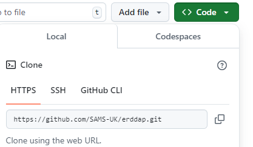
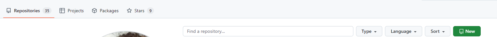
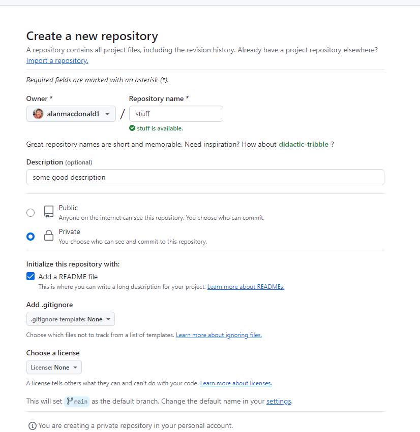

# **Git quickstart guide**

 
**Prerequisites**
* Git installed on your system.
*  A GitHub account set up.


## When you want to push to an existing github repo:

**Q:** The git repository already exists and I want to contribute

A: In a terminal of your choice (IDEs also have GUIs for this too)

1. Clone the repository:
```
git clone https://github.com/username/project-title.git
```




2. Check your url is set:
```
git remote -v
```


3. Check current branch:
```
git branch
```  
 
 
> [!IMPORTANT]  
> **At this point you want to decide on a branch to push changes to. If wanting to push to default branch:**
    
Change a file then add changes:
```
git add Readme.md
```  

Commit the change:
```
git commit -m "added something to the readme doc"
```  
 
 
Commit the change:
```
git push
```  
 
> [!IMPORTANT]  
> **If you dont want to push directly to the default branch, but want to create a new branch to test ideas:**
 
Change a file then add changes e.g.
```
git add Readme.md
```


Commit the change:
```
git commit -m "added something to the readme doc
```  

Create a test branch:
```
git switch -c my_test_branch
```  

  
Push the changes:
```
git push -u origin my_test_branch
```  


## When you want to set up a new repository for a project and push that to github


If you need to create a new repo (this is best to do on your own personal github page e.g. https://github.com/jimihendrix) you can do the following:


Go to GitHub, log in, and click on the + New Repository button.




Provide a name for your repository (e.g., project-title) and click Create Repository.



GitHub will provide the repository URL (e.g., **`https://github.com/username/project-title.git"`**).


In your terminal: 

1. git init
2. Initalize: **`git init`**
3. Change a file then add changes e.g.  **`git add Readme.md`**
4. Commit the changes: **`git commit -m "added something to the readme doc"`**
5. Set the remote URL: **`git remote add origin https://github.com/username/project-title.git"`**
6. Push to a branch e.g. push to the main branch **`git push -u origin main`**  


## When you want to pull changes from a github repo:


fetch the changes:
```
git fetch
```

- What It Does:
  1. Downloads changes (commits, branches, tags) from the remote repository but does not automatically merge them into your local branch.
  2. Updates the references to the remote branches (e.g., origin/main) in your local repository.
- When to Use:
- When you want to see what changes are available on the remote repository without altering your working directory or current branch.


[!WARNING]
The following merges changes from the remote branch into your local branch. Uncommitted changes are protected, but merge conflicts may arise if your local branch has divergent commits.

pull the changes:
```
git pull
```

- What It Does: Combines the functionality of git fetch and git merge. Downloads changes from the remote repository and merges them into your current branch.


 
